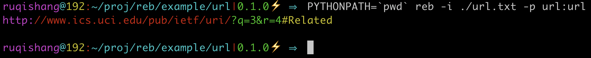

[中文 README](./README.zh.md)

# reb -- Regular Expression Beautiful


To make **information extraction with patterns** easier, reb tries to improve traditional re in some ways:

* Maintainability
* Reusability
* Readability

For that, several ideas are introduced:

* A pythonic pattern style
* Examples make reading and writing easier
* Return parse tree rather than "Match Object"

## A simple case for first impression

reb helps write regular expressions in a composable and more readable style. Take url parsing and extracting as an example.

According to [rfc3986](https://tools.ietf.org/html/rfc3986), a simple regular expression that matches urls:

```re
^(([^:/?#]+):)?(//([^/?#]*))?([^?#]*)(\?([^#]*))?(#(.*))?
```

can be rewritten with reb like:

``` python
from reb import P  # "P" for "Pattern"

scheme = P.n(P.nic(':/?#'), 1) + ':'  # "nic" for "Not In Chars"
                                      # "n" for "repeat for N times"

hier = P.n01('//' + P.n(P.nic('/?#'))) + P.n(P.nic('?#'))  # "n01" repeat for zero or 1 time

query = P.n01('?' + P.n(P.nic('#')))

fragment = P.n01('#' + P.n(P.ANYCHAR))

url = P.tag(P.n01(scheme), tag='scheme') \

        + P.tag(hier, tag='hierachy') \
        + P.tag(query, tag='query') \
        + P.tag(fragment, tag='fragment')
```

And here is how the match goes. It can be seen by the command-line tool `reb`:



As it shows, tagged parts are filled with different colors, so that scheme, hierarchy, query, and fragment in the url are extracted.

## Work with examples

Sometimes it is also hard to "parse" reb patterns with eyes and figure out which cases it matches. Naming helps writing explicit expressions, and another way to make it more readable is to bind patterns with examples.

``` python
from reb import P

scheme = P.example(
    P.n(P.nic(':/?#'), 1) + ':',
        'http:',
        'https:'
)

hier = P.example(
    P.n01('//' + P.n(P.nic('/?#'))) + P.n(P.nic('?#')),
        '//google.com',
        'localhost',
        '127.0.0.1:8080',
)

query = P.example(
    P.n01('?' + P.n(P.nic('#'))),
        '',
        '?a=1',
        '?a=1&b=2',
)

fragment = P.example(
    P.n01('#' + P.n(P.ANYCHAR)),
        '',
        '#head'
)

url = P.tag(P.n01(scheme), tag='scheme') \

        + P.tag(hier, tag='hierachy') \
        + P.tag(query, tag='query') \
        + P.tag(fragment, tag='fragment')
```

In the code above, each part of the pattern is bound with examples.

Examples do not change matches and extractions, but during the declaration (creation) of the pattern, a validation is done, ensuring the pattern appears in each of the examples given. With well-selected examples, code readers (somebody else or maybe the author 3 months later) will get something from seeing them: perhaps cases that the expression was derived from, or the purpose of it. It is designed as a mechanism to explicitly "encode" our thoughts together with patterns in writing, and trace them back on reading. Pattern authors can use examples to convey more information to readers, and "make an agreement" easier with maintainers. **So examples work like comments**, but well, "explicit is better than implicit".

Regular expressions are widely used in some information extraction tasks in natural languages. As corpus goes complex, the regular expressions we write tend to become big and long, which is difficult to read and understand, not to mention to modify. Even if patterns are divided into small parts, it is still a hard job to maintain or extend them, partly because no alarm happens when good cases turn bad. So **on the other hand, examples work as a sort of test**. With a careless pattern modification, one of the examples may fail the creation of the pattern, which in turn alarms coders to pay attention in the first place.

## Match more than one group with same tag

Queries in url can be joined with "&", like passing multiple arguments. What if we want to extract each argument and its value? We may want to write traditional re like this:

```re
\?(?P<query>[^#&]*)(&(?P<query>[^#&]*))*
```

Unfortunately, it raises an compile error, complaining that the same group "query" is declared more than once.

```text
sre_constants.error: redefinition of group name 'query' as group 3; was group 1 at position 25
```

In the information extraction area, it is a common demand to tag two or more different text segments with the same label. In reb, it can be done by tag, like:

``` python
from reb import P

scheme = P.example(
    P.n(P.nic(':/?#'), 1) + ':',
        'http:',
        'https:'
)

hier = P.example(
    P.n01('//' + P.n(P.nic('/?#'))) + P.n(P.nic('?#')),
        '//google.com',
        'localhost',
        '127.0.0.1:8080',
)

a_query = P.tag(P.n(P.nic('#&')), tag='query')

query = P.example(
    P.n01('?' + P.n(a_query + '&') + a_query),
        '',
        '?a=1',
        '?a=1&b=2',
)

fragment = P.example(
    P.n01('#' + P.n(P.ANYCHAR)),
        '',
        '#head'
)

url = P.tag(P.n01(scheme), tag='scheme') \

        + P.tag(hier, tag='hierachy') \
        + query \
        + P.tag(fragment, tag='fragment') 

```

The green texts show that each "a\_query" is extracted and tagged.


## Programming interface

### Pattern primitives & Pattern object

`reb.P` is the only entry for users to build a pattern object.

convention: lower case for primitive pattern builders, upper case for primitive patterns.

| primitive | short for          | traditional re counterpart |
|-----------|--------------------|----------------------------|
| pattern   |                    | literals                   |
| ic        | In Chars           | []                         |
| nic       | Not In Chars       | \[^\]                      |
| tag       |                    | just like group            |
| n         | repeat for N times | \* or \{n, m\}             |
| n01       | repeat for 0 or 1 time | \+                     |
| any       |                    | \|                         |
| onceeach  |                    |                            |
| example   |                    |                            |
| ANYCHAR   |                    | \.                         |
| STARTING  |                    | ^                          |
| ENDING    |                    | \$                         |
| NEWLINE   |                    | \\n                        |

`Pattern.extract` is the main method for pattern object. It returns a list of `PTNode` objects.

```python
class Pattern:
    def extract(self, text: str) -> List[PTNode]:
        """Extract info from text by the pattern, and return every match, forming a parse tree"""
```

NOTE: *versions till now do not comply with posix regular expression standard, nor python re interface*

### Parse Tree Node

#### class PTNode

* `PTNode.text` original text that the parse tree was extracted from
* `PTNode.string` same as `PTNode.text`
* `PTNode.content` a text segment that matches a pattern
* `PTNode.start()` start index of the match
* `PTNode.end()` end index of the match
* `PTNode.children` children nodes of the parse tree
* `PTNode.fetch(tag)` iterate all nodes with tag `tag` in the parse tree
* `PTNode.pp()` pretty print
* `PTNode.show()` print parse tree in details
