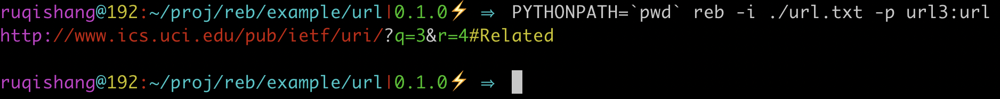

# reb -- Regular Expression Beautiful


在用模式匹配进行文本信息抽取时，为了使其过程更简便，reb 尝试在一下几点改进传统正则表达式：

* 可维护性
* 可重用性
* 可读性

为此，引入如下几个机制

* 用 pythonic 的风格写正则规则
* 允许指定用例，让读正则、写正则变得更简单
* 返回匹配出的整个解析树，而不是 "Match Object"

## 一个简单的例子

用 reb 写正则规则的风格更可读，且能够使模式间互相组合。接下来拿解析、提取 url 来做说明。

根据 [rfc3986](https://tools.ietf.org/html/rfc3986), 一个能匹配 url 的正则表达式：

```re
^(([^:/?#]+):)?(//([^/?#]*))?([^?#]*)(\?([^#]*))?(#(.*))?
```

用 reb 风格可以写作：

``` python
from reb import P  # "P" 意为 "Pattern"

scheme = P.n(P.nic(':/?#'), 1) + ':'  # "nic" 意为 "Not In Chars"
                                      # "n" 意为 "repeat for N times"

hier = P.n01('//' + P.n(P.nic('/?#'))) + P.n(P.nic('?#'))  # "n01" 出现 1 次或不出现

query = P.n01('?' + P.n(P.nic('#')))

fragment = P.n01('#' + P.n(P.ANYCHAR))

url = P.tag(P.n01(scheme), tag='scheme') \

        + P.tag(hier, tag='hierachy') \
        + P.tag(query, tag='query') \
        + P.tag(fragment, tag='fragment')
```

一下截图显示了匹配情况，用命令行入口 `reb` 即可：


正如所见，模式中打上不同标签的部分在文中染上相应颜色，也就是说，scheme，hierachy，query，fragment 这些部分均已被提取出来。

## 指定用例

读正则时，相当于用肉眼解析正则，再回推它能够匹配哪些文本。上文看到，分割、命名能够让正则可读性更好，然而另一个办法，可以给模式添加一些用例：

``` python
from reb import P

scheme = P.example(
    P.n(P.nic(':/?#'), 1) + ':',
        'http:',
        'https:'
)

hier = P.example(
    P.n01('//' + P.n(P.nic('/?#'))) + P.n(P.nic('?#')),
        '//google.com',
        'localhost',
        '127.0.0.1:8080',
)

query = P.example(
    P.n01('?' + P.n(P.nic('#'))),
        '',
        '?a=1',
        '?a=1&b=2',
)

fragment = P.example(
    P.n01('#' + P.n(P.ANYCHAR)),
        '',
        '#head'
)

url = P.tag(P.n01(scheme), tag='scheme') \

        + P.tag(hier, tag='hierachy') \
        + P.tag(query, tag='query') \
        + P.tag(fragment, tag='fragment')
```

在上面代码中，url 的每个部分都配有用例。

加用例并不影响模式的匹配和提取过程。区别在于，当模式声明时（模式对象创建时），会做一次检验，确保配有用例的模式一定出现在每个用例当中。
如果精心设置一些用例，读代码的人（可能是其他开发者，也可能是原作者回头读代码）看到这些用例就能了解到一些信息：当时这条规则是从哪种/哪个文本中总结出的，进而明白，这条模式的意图是什么。
用例机制允许写模式时把一些思考过程同时写下来，使读的时候有迹可循。
或者说，规则的作者可以传达给读者一些额外的信息，确保双方面对这段代码时理解一致。
所以说，**用例的作用类比代码注释**。然而“明确的比不明确的要好”。

在一些自然语言的信息提取场景中，正则的用途广泛。随着预料变得复杂，正则模式会加到很长，即不好读，也不好懂，更不用说修改了。
就算模式被分割成小片段，依然不好改、不好维护。其中一个原因是，改动之后原本可以匹配的没匹配，此时没有任何提示。所以说，另一方面，**用例的作用类比测试**。当不小心把模式改错了，某个用例就会失败，这个模式定义会失败。迫使开发者在最开始发现错误并做出处理。

## 允许同名的组出现多次

在 url 里，若干查询之间可以用 "&" 符号分割开，就像传入多个命名参数一样。
如果想把这若干个参数名字和值都匹配出来，怎么写模式呢？可能会想到 re 可以这样写：

```re
\?(?P<query>[^#&]*)(&(?P<query>[^#&]*))*
```

其实这样写是不行的，会抛出异常，说 query 这个组定义了不止一次。

```text
sre_constants.error: redefinition of group name 'query' as group 3; was group 1 at position 25
```

但在做信息抽取时，这个需求很普遍。只是想给两个不同的片段打上同一个标签，不一定必须出现一次。在 reb 里，用 tag 就可以做到同等的效果：

``` python
from reb import P

scheme = P.example(
    P.n(P.nic(':/?#'), 1) + ':',
        'http:',
        'https:'
)

hier = P.example(
    P.n01('//' + P.n(P.nic('/?#'))) + P.n(P.nic('?#')),
        '//google.com',
        'localhost',
        '127.0.0.1:8080',
)

a_query = P.tag(P.n(P.nic('#&')), tag='query')

query = P.example(
    P.n01('?' + P.n(a_query + '&') + a_query),
        '',
        '?a=1',
        '?a=1&b=2',
)

fragment = P.example(
    P.n01('#' + P.n(P.ANYCHAR)),
        '',
        '#head'
)

url = P.tag(P.n01(scheme), tag='scheme') \

        + P.tag(hier, tag='hierachy') \
        + query \
        + P.tag(fragment, tag='fragment') 

```

从截图中绿色的文字可以知道，"a\_query" 这个模式均被提取并在原文中打上标签。



## 程序接口

### Pattern 原语 和 Pattern 对象

`reb.P` 是构建模式时用户需要用到的唯一入口。

此处的约定是，原语都用小写字母意味着它是一个模式工厂，原语都用大写字母意为着它已经是一个模式。

| 原语       | 表意               | re 当中的同名功能            |
|-----------|--------------------|----------------------------|
| pattern   |                    | literals                   |
| ic        | In Chars           | []                         |
| nic       | Not In Chars       | \[^\]                      |
| tag       |                    | just like group            |
| n         | repeat for N times | \* or \{n, m\}             |
| n01       | repeat for 0 or 1 time | \+                     |
| any       |                    | \|                         |
| onceeach  |                    |                            |
| example   |                    |                            |
| ANYCHAR   |                    | \.                         |
| STARTING  |                    | ^                          |
| ENDING    |                    | \$                         |
| NEWLINE   |                    | \\n                        |

`Pattern.extract` 方法是 pattern 对象做抽取的入口方法，它返回一系列 `PTNode` 对象.

```python
class Pattern:
    def extract(self, text: str) -> List[PTNode]:
        """Extract info from text by the pattern, and return every match, forming a parse tree"""
```

注意，*目前为止的版本不兼容 posix 正则标准，也没有和 python 自带的 re 接口保持一致*

### 解析树节点 PTNode

#### class PTNode

* `PTNode.text` 原始文本
* `PTNode.string` 同 `PTNode.text`
* `PTNode.content` 该节点对应的匹配成功的片段
* `PTNode.start()` 匹配片段的开始下标
* `PTNode.end()` 匹配片段的结束下标
* `PTNode.children` 子节点
* `PTNode.fetch(tag)` 一个迭代器，提取出所有指定标签的匹配片段
* `PTNode.pp()` pretty print
* `PTNode.show()` 打印解析树细节
